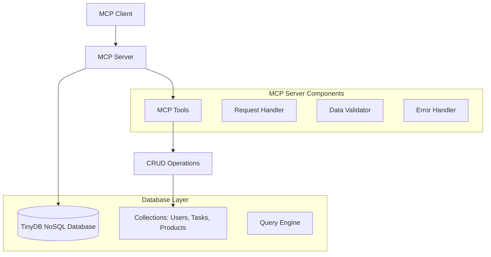

# Design Document

## Overview

The custom MCP server will be built using the Python MCP SDK and will provide a bridge between MCP clients and a local NoSQL database. The system consists of three main components: a TinyDB-based NoSQL database for lightweight local storage, an MCP server that exposes database operations as MCP tools, and a demonstration client that showcases all functionality.

The architecture follows the MCP protocol specification, where the server exposes tools that clients can invoke to perform database operations. Each tool corresponds to a specific database operation (CRUD) and returns structured JSON responses.

## Architecture



The system uses a layered architecture:
- **Client Layer**: MCP client that sends requests to the server
- **Server Layer**: MCP server that processes requests and manages tools
- **Database Layer**: TinyDB NoSQL database with collections for different data types

## Components and Interfaces

### MCP Server Component

The main server component will inherit from the MCP Python SDK's base server class and implement the following tools:

**Core Tools:**
- `create_record`: Insert new records into specified collections
- `read_records`: Fetch records with optional filtering
- `update_record`: Modify existing records based on criteria
- `delete_record`: Remove records matching criteria
- `search_records`: Advanced search with multiple filter criteria

**Tool Interface:**
```python
@server.tool()
async def create_record(collection: str, data: dict) -> dict:
    """Create a new record in the specified collection"""
    
@server.tool()
async def read_records(collection: str, filters: dict = None) -> dict:
    """Read records from collection with optional filters"""
    
@server.tool()
async def update_record(collection: str, filters: dict, updates: dict) -> dict:
    """Update records matching filters with new data"""
    
@server.tool()
async def delete_record(collection: str, filters: dict) -> dict:
    """Delete records matching the specified filters"""
    
@server.tool()
async def search_records(collection: str, query: dict) -> dict:
    """Advanced search with complex filtering"""
```

### Database Component

**Database Choice:** TinyDB - A lightweight, document-oriented database written in Python
- No external dependencies or server setup required
- JSON-based storage for easy inspection and debugging
- Query capabilities suitable for the requirements
- Perfect for local development and demonstration

**Collections Schema:**
```python
# Users Collection
{
    "id": int,
    "name": str,
    "email": str,
    "role": str,
    "created_at": str
}

# Tasks Collection
{
    "id": int,
    "title": str,
    "description": str,
    "assigned_to": int,  # user_id
    "status": str,
    "priority": str,
    "created_at": str,
    "due_date": str
}

# Products Collection
{
    "id": int,
    "name": str,
    "description": str,
    "price": float,
    "category": str,
    "in_stock": bool,
    "created_at": str
}
```

### Client Component

The demonstration client will be a standalone Python script that:
- Connects to the MCP server using the MCP client SDK
- Demonstrates all CRUD operations sequentially
- Provides clear output showing request/response cycles
- Includes error handling and connection management

## Data Models

### Database Manager Class
```python
class DatabaseManager:
    def __init__(self, db_path: str):
        self.db = TinyDB(db_path)
        self.users = self.db.table('users')
        self.tasks = self.db.table('tasks')
        self.products = self.db.table('products')
    
    def initialize_sample_data(self):
        """Populate database with sample data"""
        
    def create_record(self, collection: str, data: dict) -> dict:
        """Insert new record and return result"""
        
    def read_records(self, collection: str, filters: dict = None) -> list:
        """Fetch records with optional filtering"""
        
    def update_records(self, collection: str, filters: dict, updates: dict) -> int:
        """Update records and return count of modified records"""
        
    def delete_records(self, collection: str, filters: dict) -> int:
        """Delete records and return count of deleted records"""
```

### MCP Tool Response Format
All tools will return responses in a consistent format:
```python
{
    "success": bool,
    "data": any,  # The actual result data
    "message": str,  # Human-readable message
    "count": int,  # Number of records affected (for bulk operations)
    "error": str | None  # Error message if success is False
}
```

## Error Handling

### Database Errors
- Connection failures: Graceful degradation with retry logic
- Invalid collection names: Clear error messages with valid options
- Data validation errors: Detailed field-level error reporting
- Query syntax errors: Helpful suggestions for correct syntax

### MCP Protocol Errors
- Invalid tool parameters: Parameter validation with clear error messages
- Tool execution failures: Proper error propagation to client
- Connection timeouts: Automatic reconnection attempts
- Malformed requests: Structured error responses

### Error Response Format
```python
{
    "success": False,
    "data": None,
    "message": "Operation failed",
    "error": "Detailed error description",
    "error_code": "ERROR_TYPE_CODE"
}
```

## Testing Strategy

### Unit Tests
- Database operations testing with temporary databases
- MCP tool functionality testing with mock data
- Error handling validation for all failure scenarios
- Data validation testing for all input types

### Integration Tests
- Full MCP client-server communication testing
- Database persistence verification
- End-to-end workflow testing for all CRUD operations
- Performance testing with larger datasets

### Manual Testing
- Client demonstration script serves as manual test suite
- Step-by-step verification of all requirements
- Error scenario testing with invalid inputs
- Connection reliability testing

### Test Data
- Separate test database with known data sets
- Automated test data generation for stress testing
- Cleanup procedures for test isolation
- Mock data factories for consistent testing

The testing approach ensures reliability across all components while providing clear examples of expected behavior for users extending the system.